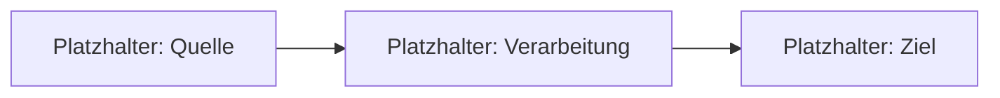

> Datenstand: {{DATUM}} – Status: Vorlage, noch nicht projektspezifisch

# Architektur — {{PROJEKTNAME}}

Beschreibt den IST-Zustand (nicht den Wunsch) — bei jeder Feature-Welle nachziehen (Checkliste „Doku-Nachzug",
`docs/ai/checklists.md`). Was noch nicht gebaut ist, gehört auf `docs/ai/backlog.md`.

## Schichten/Module

*(offen — z. B. Frontend/Backend/Datenbank, oder Layer eines Monolithen, mit Ordnerzuordnung)*

| Schicht/Modul | Ordner | Zweck |
| :--- | :--- | :--- |
| *(offen)* | *(offen)* | *(offen)* |

## Datenfluss

*(Diagramm durch den echten Datenfluss ersetzen, sobald er feststeht.)*

## Schnittstellen

*(offen — externe APIs, interne Schnittstellen zwischen Modulen, Vertragsformat)*

## Wichtige Annahmen

*(offen — was wurde vorausgesetzt, aber nicht verifiziert? Als **Annahme** markieren, sobald etwas dazukommt.)*
